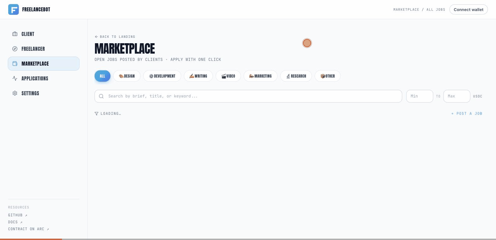

<p align="center">
  
</p>

<p align="center">
  <strong>Autonomous AI payment agent for global freelancers, built on Arc.</strong><br/>
  Clients fund USDC escrow on Arc · AI agent verifies deliverables · Payment releases in sub-second.<br/>
  <em>No PayPal fees · No SWIFT wait · No Upwork hold.</em>
</p>

<p align="center">
  <a href="https://freelancebot-alpha.vercel.app"></a>
  <a href="https://testnet.arcscan.app/address/0xA8CA04560603951b0f0e803039B059432F673ae4"></a>
  <a href="https://github.com/orangterkucil/freelancebot/blob/main/LICENSE"></a>
  
</p>

---

**Submission for:** [The Stablecoins Commerce Stack Challenge](https://challenges.ignyte.ae/competition/the-stablecoins-commerce-stack-challenge-ozc0ih6kba) — **Track 4 (Agentic Economy)**
**Tech sponsors:** Circle · Arc
**Deadline:** July 13, 2026

## Demo



_10-second silent walkthrough: landing → marketplace → filter by field → open a job → apply._

**Watch the narrated version:** [demo.mp4 (30 sec, ElevenLabs voice)](https://freelancebot-alpha.vercel.app/demo.mp4) — real Arc Testnet capture with AI voice-over covering hook, problem, solution, client + freelancer walkthroughs, tech credentials, and CTA.

**Prefer to click around yourself?** [Open the live app →](https://freelancebot-alpha.vercel.app)

## Features

- 🏦 **USDC escrow on Arc** — client deposits, contract holds, freelancer receives. All in stablecoin, sub-second finality.
- 🤖 **AI agent (Groq Llama 3.3 70B)** — verifies deliverables, recommends release, chats with both parties in their own language.
- ⚙️ **Auto-verification** — URL reachability check + deadline check + LLM brief alignment → structured JSON verdict.
- 🔐 **Smart contract verified on-chain** — source code public on [arcscan](https://testnet.arcscan.app/address/0xA8CA04560603951b0f0e803039B059432F673ae4), audit-clean (SafeERC20, custom errors, Ownable).
- 💸 **1% platform fee, configurable** — fee routes to a separate recipient address (planned: Circle Gateway for treasury splits).
- 🌐 **Multi-language agent** — auto-detects user language (Indonesian, English, Tagalog, Vietnamese, etc) and replies in kind.
- 🛡️ **Production-grade resilience** — structured logger, exponential backoff retries on API calls, lazy clients for build-time safety.
- 🔄 **End-to-end happy path** — Draft → Funded → Delivered → Released, with refund path for missed deadlines.

---

## Live links

| Resource | URL |
|---|---|
| **Live demo** | https://freelancebot-alpha.vercel.app |
| **GitHub repo** | https://github.com/orangterkucil/freelancebot |
| **Deployed contract (Arc Testnet)** | [`0xA8CA04560603951b0f0e803039B059432F673ae4`](https://testnet.arcscan.app/address/0xA8CA04560603951b0f0e803039B059432F673ae4) ✓ source verified |

---

## The bottleneck we attack

A freelancer in Jakarta accepts a $300 logo job from a US client. Today:

- Platform fee (Upwork/Fiverr): 5–10% → loses $15–30
- Withdrawal fee + FX spread: 3–5% → loses another $9–15
- SWIFT/PayPal flat fee: $25–50
- Time-to-cash: **10–18 days**
- **Net to freelancer: ~$220 after 2+ weeks**

With FreelanceBot on Arc:

- Smart contract escrow fee: < $0.10
- Arc finality: < 1 second
- USDC → IDR via local exchange: ~1% spread, < 1 hour
- **Net to freelancer: ~$297 in under 60 minutes**

That's **+22% more income** and **400× faster cashflow**, repeated for every gig.

## Architecture

```
Client (NYC)                                  Freelancer (Jakarta)
   │                                                 │
   │ 1. createAndFund(freelancer, amount, brief)     │
   ├──────────────► FreelanceEscrow (Arc) ◄──────────┤
   │                  (holds USDC)                   │
   │                       ▲                         │
   │                       │ 3. submitDelivery(url)  │
   │                       │                         │
   │                       │                         │
   │  5. approveAndRelease(orderId)                  │
   │      OR                                         │
   │      AI Agent calls release after verify        │
   │                                                 │
   ▼                                                 ▼
                       USDC settles
                       sub-second finality
                       fee predictable
                       (denominated in USDC, not gas token)
```

Off-chain, the AI agent (Groq Llama 3.3 70B) handles:
- **Chat** with both parties for clarification
- **Deliverable verification** — URL reachable, deadline match, brief alignment (structured JSON verdict)
- **Release recommendation** — never auto-releases for safety, but tells the client when it's ready

## Tech stack

| Layer | Tool | Why |
|---|---|---|
| Frontend | Next.js 14 (App Router), TypeScript, Tailwind | Modern, type-safe, ships fast |
| Backend | Vercel Serverless Functions | Zero-ops scaling, same repo |
| Database | Supabase (Postgres + RLS) | Off-chain mirror of orders + chat |
| AI agent | Groq (Llama 3.3 70B) | Sub-second LLM inference, free tier |
| Smart contract | Solidity 0.8.24 on Arc testnet, deployed via Remix | Sub-second finality, USDC-native gas |
| Wallet UX | Circle Wallets (planned, week 6) + MetaMask fallback | Onboarding for non-crypto users |
| Settlement | **USDC on Arc** | Predictable USD-denominated fees |

## Circle products used

| Product | Role |
|---|---|
| **USDC** | Settlement currency for all escrow operations |
| **Arc Testnet** | L1 deployment target; USDC-native gas, sub-second finality |
| **Circle Wallets** (planned) | Embedded wallets so non-crypto users onboard without MetaMask |
| **Circle Gateway** (planned) | Treasury routing for platform-fee splits |

See [`circle_product_feedback.md`](./circle_product_feedback.md) for our detailed feedback on Circle's developer experience.

## Repo layout

```
freelancebot/
├── src/
│   ├── app/
│   │   ├── page.tsx              # Landing
│   │   ├── client/page.tsx       # Client dashboard (create + list orders)
│   │   ├── freelancer/page.tsx   # Freelancer dashboard (list orders)
│   │   ├── orders/[id]/page.tsx  # Order detail: chat + actions
│   │   └── api/
│   │       ├── agent/route.ts    # AI agent chat endpoint (Groq)
│   │       ├── verify/route.ts   # Deliverable verifier
│   │       └── orders/...        # Order CRUD
│   ├── components/
│   │   ├── EmailGate.tsx         # Simple email-based identity
│   │   ├── AgentChat.tsx         # Chat UI
│   │   ├── OrderActions.tsx      # Role-aware action panel
│   │   ├── CreateOrderForm.tsx
│   │   ├── OrderCard.tsx
│   │   └── StatusBadge.tsx
│   └── lib/
│       ├── agent.ts              # Agent core + verifyDeliverable
│       ├── orders.ts             # Supabase DB helpers
│       ├── api.ts                # Browser API client
│       ├── supabase.ts           # Lazy Supabase clients
│       ├── groq.ts               # Groq SDK wrapper
│       └── contracts.ts          # On-chain bindings
├── contracts/
│   ├── FreelanceEscrow.sol       # Milestone escrow (deployed + verified)
│   ├── MockUSDC.sol              # Test fixture
│   ├── test/FreelanceEscrow.test.js  # 18-case test suite
│   ├── scripts/deploy.js
│   ├── hardhat.config.js
│   └── README.md
├── supabase/
│   └── schema.sql                # orders + messages tables
├── .env.example                  # All required env vars (placeholders)
└── README.md
```

## API surface

All routes under `src/app/api/`.

| Method | Path | Purpose |
|---|---|---|
| `POST` | `/api/orders` | Create a draft order |
| `GET`  | `/api/orders?email=<email>` | List orders for a user |
| `GET`  | `/api/orders/[id]` | Fetch order + message thread |
| `PATCH`| `/api/orders/[id]` | Sync onchain_id / status after on-chain action |
| `POST` | `/api/agent` | Append a user message, get agent reply |
| `POST` | `/api/verify` | Submit deliverable, get verification verdict |

### Verify verdict shape

```json
{
  "verified": true,
  "confidence": "high",
  "reasoning": "URL is reachable and contents appear to satisfy the brief...",
  "checks": {
    "urlReachable": true,
    "deadlineMet": true,
    "briefAlignment": "matches"
  }
}
```

## Smart contract

`FreelanceEscrow.sol` deployed at [`0xA8CA04560603951b0f0e803039B059432F673ae4`](https://testnet.arcscan.app/address/0xA8CA04560603951b0f0e803039B059432F673ae4) on Arc Testnet, with source code verified on arcscan.

### Constructor parameters used

| Param | Value | Meaning |
|---|---|---|
| `_usdc` | `0x3600000000000000000000000000000000000000` | USDC on Arc Testnet |
| `_agent` | `0xe552FC0909f10E0e224F28f5BA773643B76ED58E` | Wallet authorised to release on behalf of client |
| `_agentFeeBps` | `100` | 1% platform fee |
| `_agentFeeRecipient` | `0xe552FC0909f10E0e224F28f5BA773643B76ED58E` | Where fee accrues |
| `_refundGracePeriod` | `604800` | 7 days after deadline before refund opens |

### Functions

- `createAndFund(freelancer, amount, brief, deadline) -> orderId` — client deposits USDC and opens an order
- `submitDelivery(orderId, deliverable)` — freelancer marks deliverable
- `approveAndRelease(orderId)` — client OR agent releases funds, deducting platform fee
- `refund(orderId)` — anyone can trigger after deadline + grace, returns funds to client

Full test suite: 18 cases in `contracts/test/FreelanceEscrow.test.js` covering happy path, edge cases, admin functions, and end-to-end Jakarta→NYC scenario.

## Try the live demo — no install required

**👉 https://freelancebot-alpha.vercel.app**

The demo is a hosted instance with a real source-verified contract on Arc Testnet. 90-second walkthrough:

1. **Open the demo** — click **"Open live demo"** from the landing page, or visit `/client` directly.
2. **Sign in as a client** — any email (no verification — demo mode). You land in the client dashboard.
3. **Post a job** — `+ New order` → pick **Public marketplace** → choose a category (Design / Dev / Writing / Video / Marketing / Research) → write a brief → set a USDC amount → post. Job goes live on the marketplace.
4. **Browse `/jobs`** — open in another tab. Your job appears, filterable by field and budget.
5. **Apply as freelancer** — click your job, fill a pitch + optional counter-bid, send the application.
6. **Accept** — back on the order as the client, see the applicant, click **Accept**. Order becomes private and escrow flow begins.
7. **Fund** — click **Fund USDC**. With MetaMask on Arc Testnet (Chain `5042002`) and USDC from [faucet.circle.com](https://faucet.circle.com), the escrow contract pulls the USDC on-chain. Otherwise the demo simulates.
8. **Deliver** — switch to freelancer view, submit a deliverable URL. The Groq Llama 3.3 70B agent checks reachability + deadline + brief alignment, returns a verdict.
9. **Release** — as client, click **Approve & release**. USDC settles to the freelancer in sub-second finality on Arc.

No clone, no install — open the link and try it.

---

## For contributors and self-hosters

Skip this section if you're just here to use the demo. The rest is for forking the repo and running your own instance.

### Prerequisites
- Node.js 20+
- A Supabase project (free tier)
- A Groq API key (free tier)
- An Arc testnet wallet with testnet USDC ([faucet](https://faucet.circle.com))

### Install + run

```bash
git clone https://github.com/orangterkucil/freelancebot.git
cd freelancebot
npm install
cp .env.example .env.local   # then fill in your values
npm run dev
# open http://localhost:3000
```

Apply the database schema once: copy `supabase/schema.sql` into your Supabase project's SQL Editor and run it. Idempotent.

### Compile + test contracts

```bash
cd contracts
npm install
npm test       # 18 test cases
```

### Deploy contract to Arc testnet

```bash
# from contracts/
npm run deploy:arc
# Copy printed address into NEXT_PUBLIC_ESCROW_ADDRESS in ../.env.local
```

Or use Remix in the browser — no local Node install required. See [`contracts/README.md`](./contracts/README.md).

## Roadmap

- [x] Week 1 — Setup, accounts, scaffold, architecture diagram
- [x] Week 2 — Smart contract + 18-case test suite
- [x] Week 3 — AI agent + verifier + orders API
- [x] Week 4–5 — Frontend MVP (client + freelancer + order detail + chat)
- [x] Week 6 — Smart contract deployed + verified on Arc testnet
- [x] Week 7 — Wire frontend to on-chain (ethers.js), polish, marketplace + ratings + settings + docs + OWASP hardening (v0.7 → v0.11.2)
- [ ] Week 8 — Record video, submit to Ignyte

## Project documents

- [**PRD.md**](./PRD.md) — Product Requirements Document covering MVP 1 (shipped) and MVP 2 (roadmap), stack recommendations, governance.
- [**CHANGELOG.md**](./CHANGELOG.md) — every release, with semantic version, date, and a Keep-a-Changelog-style entry.
- [**VERSIONING.md**](./VERSIONING.md) — SemVer scheme + how to cut a release (`npm run release:minor` etc).
- [**circle_product_feedback.md**](./circle_product_feedback.md) — honest Circle DX feedback (hackathon submission requirement).
- [**submission_narrative.md**](./submission_narrative.md) — one-page pitch.
- [**video_demo_script.md**](./video_demo_script.md) — 7-section storyboard + compression instructions.

## License

MIT
